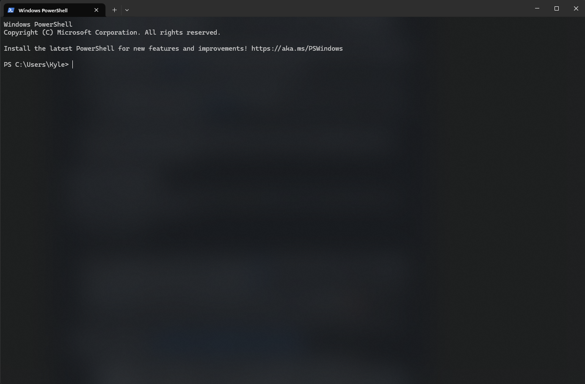
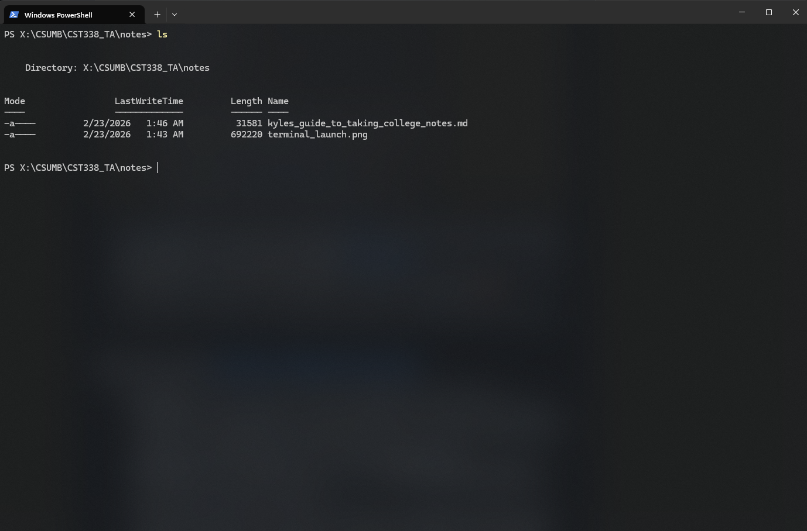
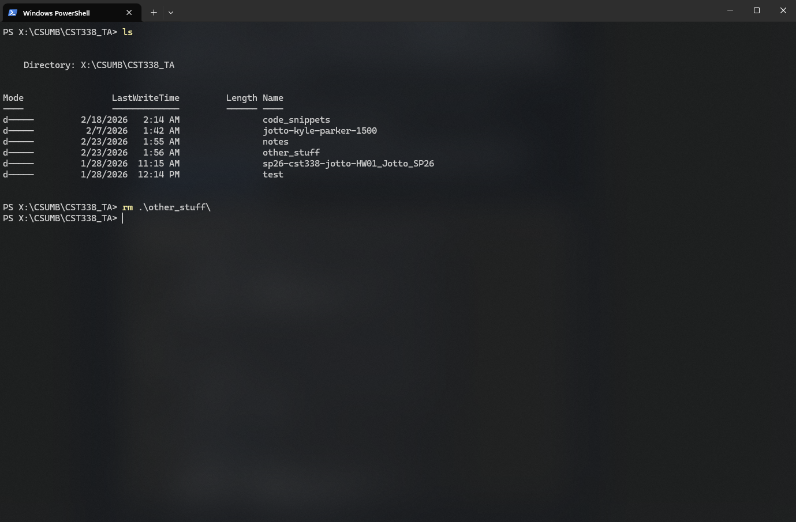
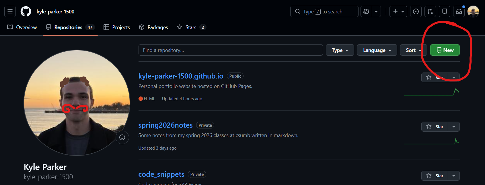
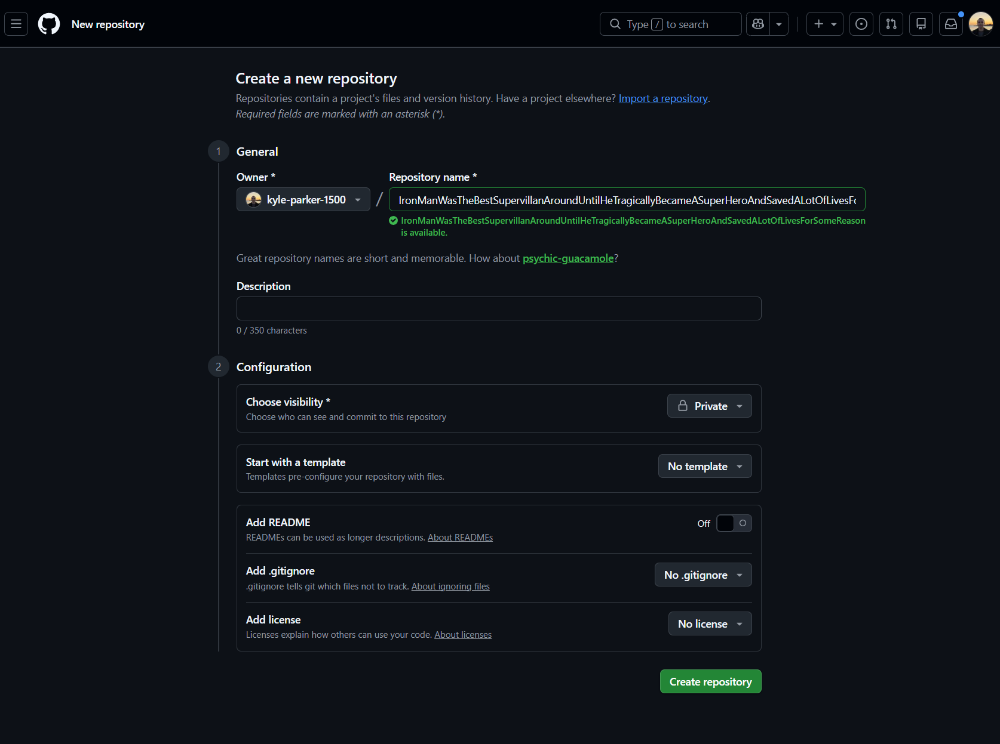
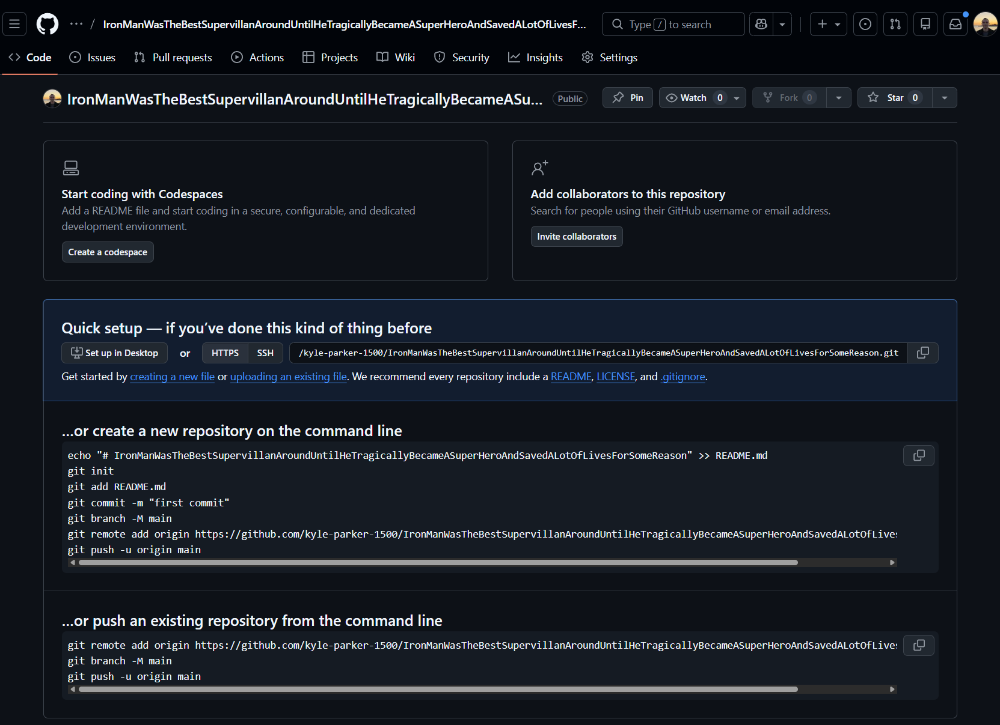
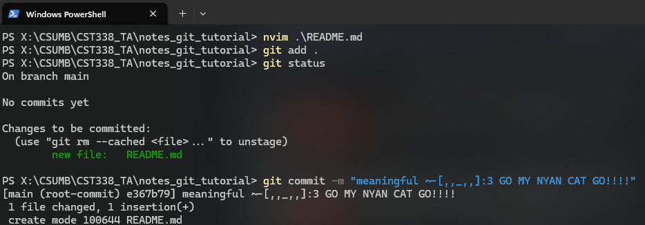
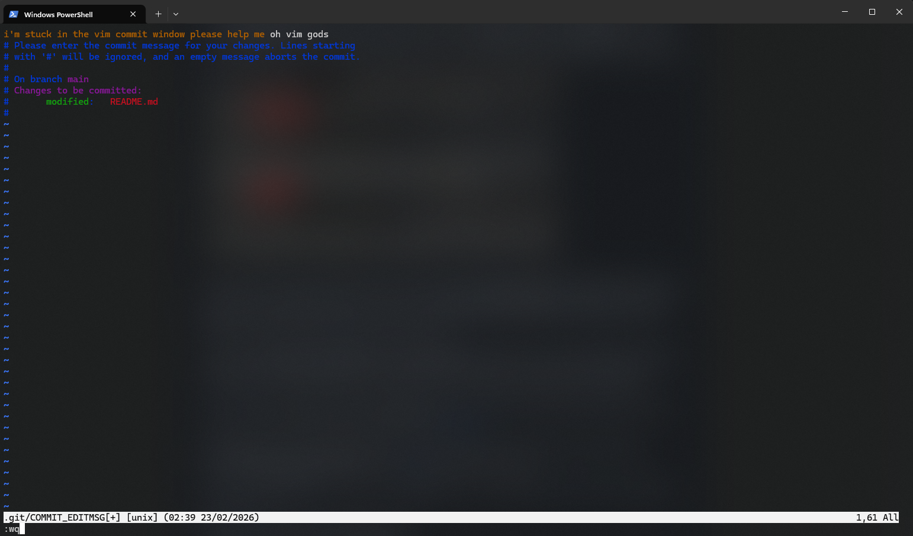
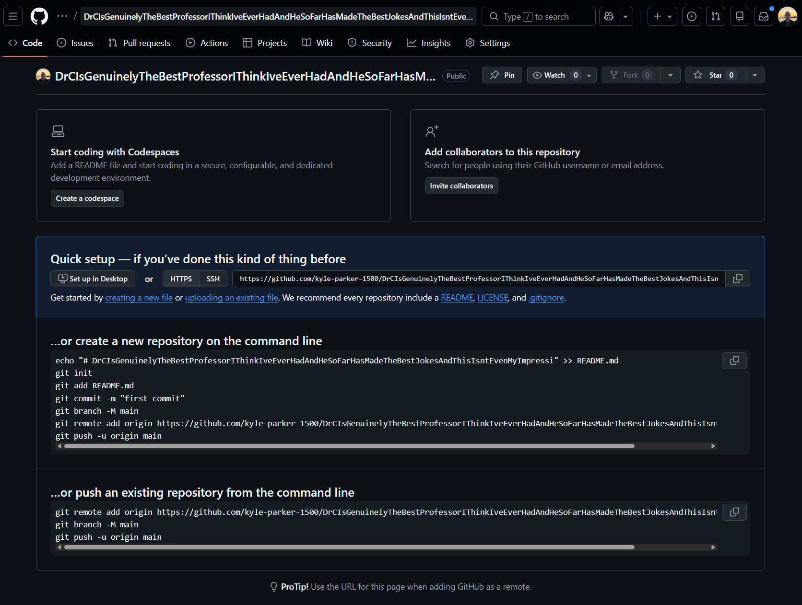
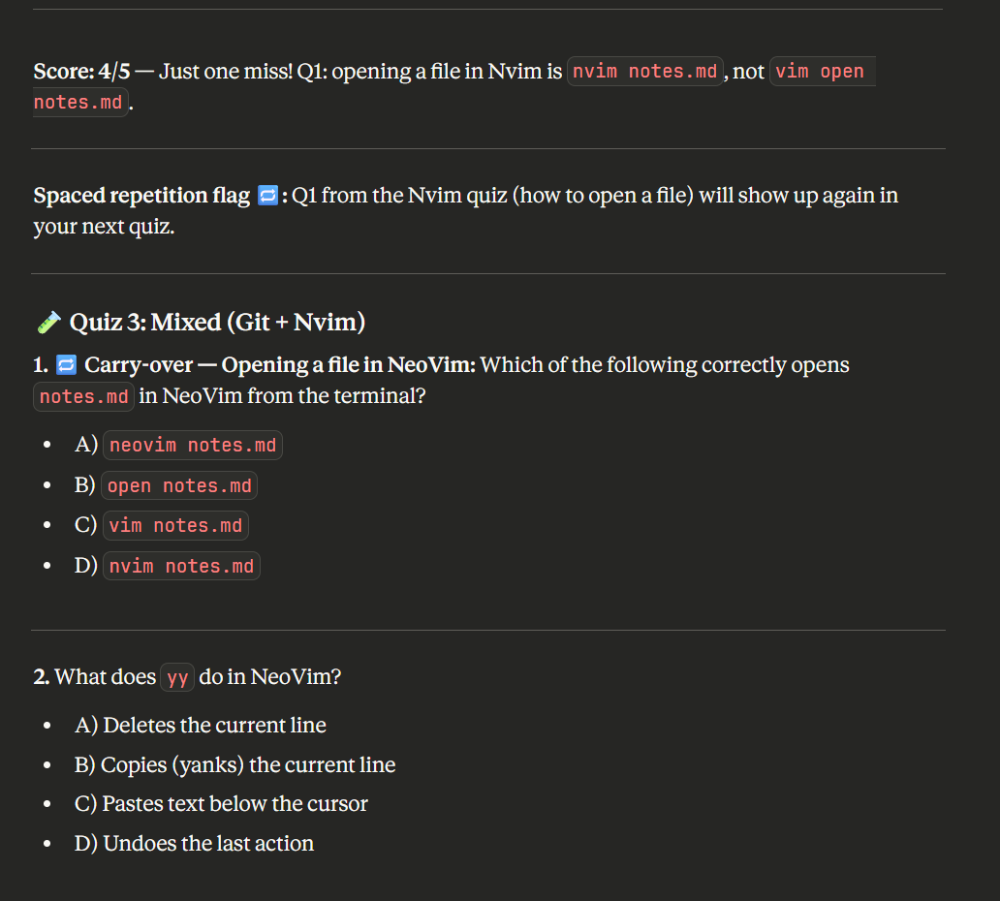

# Easy College Notes (For CS Students Mostly)

This is a step by step guide to show you how to _A_, take good notes and _B_, study more efficiently.

## Taking "Effective" Notes

In this case, any notes are effective notes, so the style of them doesn't really matter. <br>
I'll attach some of my notes to this document to show you how I generally take notes.

1. You have to first ask yourself: Am _I_ a VIM user?

The answer may be no at first but let me tell you this:
I used to hate sitting down to code, mostly because using a mouse was annoying to say the least, so I picked up VIM (and I'm never going back)

Basically your answer should be yes, but I'll account for both cases in-case you're not ready to take the leap
If you're not ready click this: [Non-Vim Tutorial (Boring)](#for-regular-people)

## For VIM Users

By the way, I'm including EMACS and other text editor users in this case. (Although if you use them and not VIM what are you even doing tbh) → :)

1. Install VIM. I would suggest **NeoVim** for everyone: Essentially it's VIM, just a newer version

- Here's the [Link](https://neovim.io/doc/install/) for Windows and a blog [post](https://dev.to/ajtech0001/complete-guide-installing-and-configuring-neovim-on-macos-4a9e) for Mac
- You can also get a NeoVim plugin on both **Intellij** and **VSCode** (which, if you're serious about learning VIM, is a great idea. (It's called immersion))

2. After installing NeoVim and getting it working → you can check if it's working by doing `nvim --version` on both Unix (Mac and Linux) and Windows
3. (Optional) I would also _very_ highly recommend you install a plugin manager for NeoVim. This just helps if you want a different look and feel for your NeoVim than the default (which looks boring and doesn't feel good). My current plugin manager is [LazyVim](http://www.lazyvim.org/), because I'm lazy and I like using VIM.

- Pro tip: After doing this you can ask AI → mainly Claude to create plugins for you! (This comes directly from Dr. C...'s blog post from a couple years ago) -> AND IT WORKS!
  - Here's the link if anyone wants it: [Dr. C's Blog](https://clinkenbeard.info/blog/2025/claude-dev-tool-customization/) → I'm not sure how happy he'll be with me for sharing this btw so maybe don't mention it to him

4. If you're not comfortable with using a plugin manager such as LazyVim: I would suggest you use either VSCode or Intellij. I personally prefer VSCode because it takes less time to start up normally, and it feels more versatile. But it's really up to you.

### Time to take Notes

Now that we're ready to take notes, let me walk you through my typical setup. Since I know most of you are CS majors, I'll try to include a lot of pictures.

1. Launch your terminal.



- If you're on _Windows_ you should install the _terminal app_ ([Link](https://apps.microsoft.com/detail/9N0DX20HK701?hl=en-us&gl=US&ocid=pdpshare)) from the Windows Store and use Powershell with it. Alternatively (to Powershell, you should definitely get _terminal_), you can use WSL2 to get a Linux style shell within Windows. Here's the tutorial for installation: [WSL2 Installation](https://learn.microsoft.com/en-us/windows/wsl/install)
- Linux and Mac users, you're fine. (I bet all you Linux users are excited to be put before Mac in this sentence. It's probably the first time you've ever been picked first for anything... except hackathons :) )

2. Linux shame aside (I use Windows I shouldn't be talking), navigate to a folder that you want to take notes in.



#### Terminal Commands

[Back To Regular People (More Like Boring People) Tutorial](#initializing-a-git-repo-on-a-local-machine)

- These instructions are for those of you who don't know how to navigate through the terminal:
  - `cd directory` - to enter a directory → _hint:_ you can use `cd ..` to go up a directory (to go back to the previous directory) or `cd ../../../../..` to go back many directories. Using this you can go pretty much anywhere in your terminal. If you want to navigate to a different hard drive you can do `cd` to get to your root directory, then `cd drive:` it would look like -> `cd v:` or just `v:` if you're lazy (don't worry I know you better than you know yourself... you're lazy).

  - `mkdir new_name` you can use `mkdir` to 'make directory', the `directory name` shouldn't contain any spaces. Although, I _think_ you can include spaces if you do something like `mkdir "new_directory"` but that's bad practice, especially for programmers.

  - If you want to open VSCode from your current directory you can use `code .`, make sure you have an _environment variable_ set up for VSCode first. You can also just open any file in VSCode using `code /this/is/a/path/name/directory(or file)`. Keep in mind, if you want to open a file you have to specify the file type.

  - `ls` → use `ls` to list everything in the current or specified directory. Specified meaning `ls /path/to/dir`

  - `mv` to either move a file or rename → _moving_: `mv filename.filetype ../previous_directory` or _renaming_: `mv filename.filetype new_filename.filetype`, you can also rename directories with this command.

  - `rm` → be careful with this one. This is how you delete things: `rm filename.filetype`, if someone tells you to `rm -rf` something DON'T LISTEN TO THEM!! `-rf` is an option that recursively forces all files and all directories to be removed from your current or specified directory all the way down (this is only for Mac and Linux users though... I think).

  - `clear` → use this to clear your terminal screen of all the "hard" work you've been doing

  - Final thing → use `pwd` to check your _present working directory_

  - That's basically it for basic terminal commands (these apply to both windows terminal and unix terminals). If you want something more advanced check out some guides online: Here's one → [Advanced Guide (For Nerds)](https://serverspace.us/support/help/windows-cmd-commands-cheat-sheet/)

  Here are those commands in action:
  
  
  
  You can also use `Tab` the key on your keyboard to autocomplete your command (you're dumb for still reading the stuff inside these parenthesis)

1. Now that our basic terminal commands tutorial is over let's get on to notes:

- Navigate to the folder that you want your notes to be in. I would suggest naming it something like `SCHOOL_NAME/CLASS_NAME/notes` or you can do what I do and just have one directory for all notes `SCHOOL_NAME/CURRENT_SEMESTER/CLASS_NAME/CURRENT_WEEK (or current subject)`
  - Make sure that you are inside the directory that you want to be in. You can check this by doing `pwd` (present working directory)

2. Now we're going to initialize a Git repository. If you don't already have Git → Git it: [Link](https://git-scm.com/install/) \*Nudge Nudge\* Git it, Git it... Okay I'll stop

- We do this for 2 reasons: 1. So we can push changes to GitHub and it's remote repository (and access them from anywhere), and 2. So if we f\*uck up (yes ik I didn't censor it properly), and want to restore an old version of our notes, we totally can.
  - By the way, this also allows your friends to add their own notes for a repository \*_Pyramid Scheme_\*
- So with my reasoning explained and Git installed: Let's do `git init`, alternatively you can clone a remote repository, but I prefer this method because it's more challenging, and I like challenging others.
- This initializes a new repository on our local machine, that doesn't implicitly create a repository on GitHub, however. But we'll get to that.

3. Now let's add some notes, these can be temporary or they can be real notes and you can come back to this tutorial later. Alternatively, you can drag this file into your notes folder.

- I'll assume you want to learn how to use VIM though.
- With NeoVim installed: You can navigate to your notes folder and type in `nvim filename.md`. We'll be using _markdown_ files for our notes. This is because they're easy to write and we can translate them into beautiful notes just by typing in some symbols. Here's a [Link](https://www.datacamp.com/cheat-sheet/markdown-cheat-sheet-23).
- That last command should open up a NeoVim terminal! Now, let's do a quick VIM tutorial. This most certainly will not cover everything but it is enough to get you started.

### NeoVim/Vim Tutorial

First off, here's a quick online game that you can play to get some of the movements down. [Link](https://vim-adventures.com/)

Vim is definitely much easier once you get the muscle memory down for the movements/commands. If you feel like this is too much, I can assure you, it only gets worse. BUT! Vim is an incredibly powerful text editor (or whatever it's actually called), and in a few months, or even a year, you'll be incredibly glad that you pushed yourself to learn it now. (It's useful in so many applications (also it looks cool)).

Ever pictured yourself doing some Mr. Robot type shit, me too! But not the illegal stuff, just the typing fast and being emo stuff.

- Tip: You can run `vimtutor` in the terminal to learn the first commands too!
- Got that tip from: [Link](https://vim.rtorr.com/)

**Basic NeoVim Commands:**

| Commands                                    | What They Do                                                                                |
| ------------------------------------------- | ------------------------------------------------------------------------------------------- |
| k                                           | Move Cursor Up                                                                              |
| j                                           | Move Cursor Down                                                                            |
| h                                           | Move Cursor Left                                                                            |
| l                                           | Move Cursor Right                                                                           |
| esc (escape key)                            | Enter "Normal" Mode (for moving cursor)                                                     |
| :                                           | Command Line Mode (for commands)                                                            |
| :w                                          | Write to file (save)                                                                        |
| :q                                          | Quit file (make sure to write first!)                                                       |
| :wq                                         | Write and then quit file                                                                    |
| i                                           | Insert Mode (for typing)                                                                    |
| v                                           | Visual Mode (highlighting)                                                                  |
| w                                           | Move to beginning of next word                                                              |
| e                                           | Move to end of current word                                                                 |
| b                                           | Move to beginning of previous word                                                          |
| r                                           | Replace current character                                                                   |
| R                                           | Keep replacing until esc is pressed                                                         |
| dd                                          | Delete full line (and save it until something else is deleted )                             |
| dd                                          | Cut                                                                                         |
| dw                                          | Delete word                                                                                 |
| yy                                          | Copy Line                                                                                   |
| p                                           | Paste saved text below cursor (either dd or yy, whichever was performed last)               |
| P                                           | Paste saved text above cursor (either dd or yy, whichever was performed last)               |
| o                                           | Insert empty line below cursor                                                              |
| O                                           | Insert empty line above cursor                                                              |
| gg                                          | Go to top of the file                                                                       |
| G                                           | Go to bottom of the file                                                                    |
| gul                                         | Make 1 character to the right lowercase                                                     |
| gUl                                         | Make 1 character to the right uppercase                                                     |
| \*                                          | Display all instances of the word the cursor is on (can use n and N to navigate)            |
| >>                                          | Indent one line                                                                             |
| <<                                          | Un-indent (idk what it's called) one line                                                   |
| /                                           | Search (forward) through the file (you can use N and n to navigate which word you're on)    |
| u                                           | Undo                                                                                        |
| Ctrl+r                                      | Redo                                                                                        |
| "\*y                                        | Copy specified text to clipboard                                                            |
| "\*p                                        | Paste text from clipboard                                                                   |
| :%s/word_to_replace/word_to_replace_with/   | Replace one instance of first word with second word                                         |
| :%s/word_to_replace/word_to_replace_with/g  | Replace all instances of first word with second word (without asking if it's okay to do so) |
| :%s/word_to_replace/word_to_replace_with/gc | Replace all instances of first word with second word (asks if it's okay)                    |
| :help                                       | To help you learn all commands                                                              |
| :help specific_command                      | To help you learn one specific command                                                      |

Okay that's just about all the VIM commands I know. There's so many more though. So do your research and then come teach me some commands. The more unique the command the more extra credit I'll give you! (Just kidding, I can't give out extra credit).

Keep in mind you can add numbers before any of these commands to affect many more lines.

Side note: If you want to get to full screen in LazyVim on Windows you can use `LAlt+Enter` and press it again to leave.

#### Markdown Commands

[Link Back to Reg. People Tutorial](#initializing-a-git-repo-on-a-local-machine)

- Okay! You're in VIM and you know how to use it!!
- Let's learn some markdown things now!

| Symbols                                                                                  | What They Do:                                                                      | What They Should Look Like                                                                        |
| ---------------------------------------------------------------------------------------- | ---------------------------------------------------------------------------------- | ------------------------------------------------------------------------------------------------- |
| #                                                                                        | Header 1 (Biggest)                                                                 | # Header #                                                                                        |
| ##                                                                                       | Header 2 (Second Biggest)                                                          | ## Header ##                                                                                      |
| ### (can go up to 6 #)                                                                   | Header 3 (Third Biggest)                                                           | ### Header ###                                                                                    |
| These Go Up to 6 ###### so I'm moving on. They just keep making the header text smaller. |                                                                                    |
| \`\`                                                                                     | Inline Code Highlighting (no syntax highlighting)                                  | `code`                                                                                            |
| \`\`\`name of language \`\`\`                                                            | Block Code Highlighting (provides syntax highlighting if you provide the language) | `c++ int x = 0;`                                                                                  |
| 1.                                                                                       | Ordered List (Can indent)                                                          | 1.                                                                                                |
| \-                                                                                       | Unordered List (Can indent)                                                        | -                                                                                                 |
| \*word\*                                                                                 | Italics                                                                            | _word_                                                                                            |
| \*\*word\*\*                                                                             | Bold                                                                               | **word**                                                                                          |
| \-\[\]                                                                                   | Checklist                                                                          | -[] (may not display properly)                                                                    |
| \[\]\(\)                                                                                 | Link Something                                                                     | [Text For Link Here](Link in here (no quotes needed)) [Link](https://github.com/kyle-parker-1500) |
| \!\[\]\(\)                                                                               | Display Image                                                                      | )                                          |
| \[\]\(\)                                                                                 | Link a Header                                                                      | [Link Text](\#reference-goes-here-no-spaces-all-lowercase\)                                       |

I think that's about it. Like VIM there's many more, but I either haven't learned them or forgot about them. Play around with it though. You can also insert tables, but I'll let you figure that out on your own. LazyVim makes it really easy btw!

By the way! You can also use `<br>` to insert a newline just like html. In fact, you can use quite a few html tags in markdown.

<b>stuff is bold here using a \<b> tag</b>

Oh well, you're in CS because you want money right, so do some research.

Now that you know VIM and Markdown properly, write some notes! I'll wait right here . .
. <br>
. <br>
. <br>
. <br>
. <br>
. <br>

Okay, now let's `:wq` (write quit) the file and move on to updating your git repository. (Make sure you're using `:w` often when you write your notes.)
At least as often as when you save your code, if not more. Vim/NeoVim are not the greatest at saving your work if you lose it.
But that's why we have Git!

### The Git Part

Now that we have our notes, let's connect them to a GitHub remote repository so we can access our work from anywhere.

1. Go to GitHub and navigate to your account profile. It's typically going to be `https://github.com/your-username/`
1. Navigate to the `Repositories` tab at the top next to `Overview`
1. Click on `New` in the top right corner



4. Give your repository a meaningful name (it makes it easier, trust me). I normally name mine something like: `IronManWasTheBestSupervillanAroundUntilHeTragicallyBecameASuperHeroAndSavedALotOfLivesForSomeReasonIMeanDudeHeDidntHaveToSnap` or something like that.
5. Choose your repo visibility. Since we're writing notes, I typically make mine private so people don't find my badly written notes when searching for one of my projects
6. Don't change anything besides that and create the repository.



7. A window should pop up displaying a link similar to this one: `https://github.com/your-username/your-repo-name.git`

- Note the `.git` at the end of the link, that's important for setting up your local repository so make sure you have it

8. Copy the link and go back to your local machine (make sure you open the terminal (or keep it open) to where your notes are being stored)



9. If you don't know if your notes are in your current directory remember to use `ls` (list) to check
10. Your local repository should be initialized (remember we did `git init`), so we can now do: `git remote -v` to check if we have any remote repositories connected to our local one


11. If anything other than absolutely nothing comes up either keep it because you likely know what you're doing OR do `git remote remove origin` (that removes your remote repository link)


12. Also do `git status`. If, at the top left it says you're on branch `master` then you want to execute this command `git branch -M main` which will rename it to main

- The reason we do this is because most of GitHub has moved away from using `master` as a root origin branch name

13. Now execute this command: `git remote add origin your-link` for example: `git remote add origin https://github.com/kyle-parker-1500/note-taking-tutorial.git` That's my repository for this tutorial.
14. It should say something along the lines of: _You didn't fuck up_


15. Once that's done we want to now pull any changes made to our remote repository. We know there aren't any changes but it's good practice.

- So do `git pull origin main` to update your current branch (we should be on `main`)
- If you aren't sure use `git status` to check
- If it's saying something along the lines of: `fatal: couldn't find remote ref main` then after screaming profanities at it for a little while:
  - It's basically saying that we need to add things to our remote before we pull any changes so just move on to the next step and come back here later.

16. Finally, we can stage our changes to be committed with `git add filepath/to/filename.filetype` or `git add .` → this one stages all changes to be committed, the first one only stages specific files
17. Now that we've staged our changes (you can do `git status` to check if they're staged) we can do `git commit -m "~-[,,_,,]:3 Meaningful Message"`. The `-m` stands for message, but you can omit it to pull up a VIM terminal to type your message to. (I told you VIM was useful!)
18. Now that we've committed we can do `git push origin main` (for now you're just going to push to main, but you can theoretically push to any remote branch that you want to). This will take our committed changes and merge them into our origin/upstream branch on the remote repo.

- Something to note: If you're lazy like me and don't want to type out 4 words each time you push (I mean tbf they're hard words to type every few hours), you can do `git push -u origin main`
- This will set the upstream branch of `main` to be `origin main`, and then each time after that, to push, you can use: `git push`
- You can do something similar with `git pull` &rarr; Look it up!

You should see a lot of text that says that Git is doing stuff. And then it should say successfully merged or something like that.

Keep in mind, you could have merge conflicts if you and a friend are working on the same file!

And then you're done! Hope you end up using this method for taking notes in class! Click [Here](#use-ai-to-create-quizzes-for-yourself) to go to the AI Quiz portion of the Tutorial.

## For Regular People

Yes, I'll include images. You guys really need to learn how to read real words though. Not just phi upsilon chi kappa upsilon :)

Regular people refers to uncool people who don't use VIM or NeoVim (I'm biased). I won't lie, that's the majority of you. But good news!
You can fix it! Just click this [link](#for-vim-users) to learn how to install and use NeoVim! It's really a lot worse than it seems (oops, did I
type that out loud?). It's a lot of information... but it does give you a lot of power, and you definitely see a lot less disconnect between
your thoughts and ideas and your code/text. (This isn't an ad for Vim, I swear!)

Okay let's get started with the **Regular People** tutorial:

This will assume that you have some form of [VSCode](https://code.visualstudio.com/download) or [Intellij IDEA](https://www.jetbrains.com/help/idea/installation-guide.html) installed. (You can also use NeoVim :) )
I'll stop mentioning it now.

Just so you know, I'm quite terrible at using the Git GUI (graphical user interface) so this tutorial will use purely command line Git.
With that being said: go Git [Git](https://git-scm.com/install/) if you don't have it already! \*Poke, Poke\* Git it?
(For those of you who've read everything up to this point, ignore that).

If you don't know whether or not you have Git installed you can check by navigating to your terminal (for Mac and Linux users) or literally
going to [terminal](https://apps.microsoft.com/detail/9N0DX20HK701?hl=en-us&gl=US&ocid=pdpshare) for Windows users. (Install it if you
don't have it already! Please for the love of code don't use Cmd); ← this `;` was unintentional but I'm leaving it. Anyway just do git --version to check the Git version on your terminal. If it's not working there's a good chance you either don't have it installed or messed up somewhere. In that case I would say to either ask Claude (love Claude for fixing Git issues) OR look it up.

Okay, launch your favorite IDE (Integrated Development Environment) (e.g.: Intellij or VSCode) and then open a new project.

### Initializing a Git Repo on a Local Machine

Okay let's initialize a new Git repo on your local machine. First, make sure you're inside your IDE of choice, then open the builtin terminal.
With Intellij I think the hotkey (for Windows users) is: _ctrl+escape_ for VSCode I think it's _ctrl+\`_ but don't quote me on that!

Once your terminal is open make sure that you're in your project's directory. To double check this use `pwd` (present working directory) to see
what your current file path is. You can get the filepath of your project by right clicking on where ever your project directory is and clicking _open in_ and then your file explorer of choice → ex: Finder for Mac. You can see all the terminal commands that we'll be using by clicking: [Here](#terminal-commands).

- If your terminal says that you aren't in the correct directory, make sure to click the link above and go check out the terminal commands part of
  this.
  That will help.

At this point, I'll assume you've reached the current directory of your project. Perfect!

Let's start off by initializing a Git repository.
(I realize you can do this a lot more easily using the GUI stuff but just bear with me, you
might even learn something for once).
In your terminal type `git init`. If Git is installed properly you should see something like: "Empty repository initialized."

Now let's add some notes. Just right click your empty project and click _add file_. Name the file something like `ThorIsTheGodOfThunderButHeCantEvenRunFasterThanATruckAlsoHeCantReallyFlyThatFastAndHasAnyoneEverThoughtAboutHowHeOnlyEverShootsLightningIMeanWhatIsTheGodOfThunderEvenSupposedToDoMakeLoudNoisesAndScareDogsIntoSubmissionOOOOhScary.md`.
The `.md` is very important here because that's the type of file we'll be using. It's called _markdown_ and it basically allows us to write super nice and clean notes without doing much actual work ourselves. How do you think I'm writing this tutorial right now? [Here's](#markdown-commands) a link to my notes on markdown.

Now that you're an expert on markdown I expect you to write some notes into the `.md` file and save it.

I know you haven't done it yet. Go back and do it. I'll wait for you.

<br>
<br>
<br>
<br>
<br>

Okay I know for a fact you scrolled here just to see if I would keep the bit going... Haha I did. So funny. Now go back and write something... anything!

Done? Good.

<br>
<br>
<br>
<br>
<br>
<br>
<br>

Ha! You thought you had me huh?!

<br>
<br>
<br>
<br>
<br>
<br>
<br>
<br>
<br>
<br>

Okay I'm done, on with the tutorial!

Now that you've saved it (right? you've saved it? _hint:_ use `ctrl+s` or `command+s`) we can stage our changes to commit in Git.
So reopen your terminal and type this in. Well actually, first, we want to check if you're on the correct branch.
For those of you who worked ahead and checked out a different branch, you did nothing wrong, in-fact I'd go as far as to say I'm proud of you.
But for the sake of this tutorial don't follow the next part word for word. For anyone that doesn't know what the \*fuck\* I'm talking about:
this is for you.

Type in `git status`. If it says on branch `main`, you're doing good. If it says on branch `master` we're going to have to change some things.

- The reason we have to change things is because `GitHub` is transitioning away from development branches being named `master`, why? no fucking idea. But they make it _really_ fucking annoying if we don't rename it.
- On the bright side, I get to show you how to rename a branch in Git.

So do `git branch -M main`, that should rename your branch from `master` to `main`. Do `git status` and if it says something like: You're on branch main. Then you're good. For everyone who it says something else for: good luck!


Now we're going to stage our changes. What this means is that we're going to select the changes that we want to see in our remote repository (online). To do this we can either do `git add file/path` to add specific files or `git add .` to add everything.
Once that's done you can do: `git status`. Everything should say staged, or they all should be green if your terminal is cool like mine \#imcool.

Now let's do `git commit -m "meaningful ~-[,,_,,]:3 message"` for anyone wondering, my initial commit message usually includes an ascii version of
nyan cat. `-m` means add a message, but you can omit it if you want to be thrown into a VIM window that you don't understand how to use because you refused to learn VIM (smh).



P.S. If you end up in that window simply hit `shift+o` then type a message, then hit `esc`, then `:wq`. That should get you out. If you want to understand it though go up to [Learn Vim](#for-vim-users).



Now navigate to your personal GitHub page. For example, the link for my page would look something like: `https://github.com/kyle-parker-1500/`
It's right [here](https://github.com/kyle-parker-1500/) if you want to check it out.

Click on the `repositories` tab (it's right next to `overview`). Then click on `new` (it's a green button in the top right, can't miss it).


Name your repository something meaningful like: `DrCIsGenuinelyTheBestProfessorIThinkIveEverHadAndHeSoFarHasMadeTheBestJokesAndThisIsntEvenMyImpressionOfHimAsHisTAItsMoresoJustLikeAGeneralRespectForHisLevelOfChillWhichBTWGetsALotBetterIfYouCommitEnoughTimeToHisProjectsAndUseResourcesLikeThisTutorialToLearnTheMaterialForHisClass`

Once you've done that change your repository visibility to Private (I mean you can keep it public but what if a recruiter is looking at your repo and is like wtf! why are there so many profanities in this dude's notes! Hasn't happened to me yet, but it will probably).
Don't change anything after that and hit create repository. Copy the link that's given by the next page and take note of the `.git` at the end of the link. For example: `https://github.com/kyle-parker-1500/note-taking-tutorial.git` is my remote repo link for this repository.



After that go back to your local machine and type in `git push origin main`. You should see some stuff saying that it worked. If you see a red message you either typed it wrong
or fucked up the process somehow so I wish you luck. Claude is a really good resource in this case.

If you want to only have to type `git push origin main` once per project then you can also type in `git push -u origin main`. This sets up your remote branch to be the upstream of your current branch... essentially linking them together. So the next time you want to push you can use `git push` instead of `git push origin main`. For the record,
you can also do something similar with `git pull`, but I'll let you figure out how to do that yourself.


And then we're done! That's it if you only want to take notes, but I can also show you an easy and simple way to study with those notes too. Just go to the [create quizzes with ai](#use-ai-to-create-quizzes-for-yourself) section of this tutorial. I'll even include the prompt for you to copy.

## Use AI to Create Quizzes for Yourself

Welcome to the section you've all been waiting for! **How do I use AI to help me get better grades on tests?** Well it's quite simple really. All you have to do is know what to type. But shoot Kyle... I don't know what to type! Well that's alright, because I'm able to show you pretty easily. BUT I WON'T! I'd rather gatekeep this information! You really thought I'd just give it away huh?

Well you were right. Okay so my favorite AIs to use are Claude and ChatGPT, but we don't like OpenAI that much right now so just go with Claude. It's got a better UI, it's
trained to better help programmers, it's overall better than Chat. That being said the one limitation for those of use who don't have premium is the chat limit. Now, you can
get around this by just using multiple accounts but sometimes that's a little annoying. I don't have some special hack for this, I would just say use Chat in that case. All of us at CSUMB (I think) have a premium Chat account; which affords us a much higher chat limit. For this tutorial I'll be using Claude but they're all the same.

Now keep this in mind: **Claude for _quality_**, **Chat for _quantity_**. That's what I go by anyway, but it's up to you at the end of the day which model you pick. Now, one of the beautiful things about writing your notes in `.md` and uploading them to GitHub is that you can access them from anywhere. Another is that you can clone your repository onto
just about any machine and use that machine to easily drag and drop your notes into your chosen AI engine.

So do that. Typically I have a limit of around 10 files per single chat but you can just tell Chat or Claude to wait until you've uploaded all your files for instructions. I would recommend that you create a project for each class that you want to study for and put all your notes into those projects.

You have to keep in mind that quality of your notes doesn't really matter here, what you want is to have as many notes with words that you don't understand on there. Typically what I do is copy the slides word for word and add in my own personal notes on top of those. This allows the AI to parse through your notes and find subjects that you're concerned about to quiz you on.

Now, I won't lie, this method works best for multiple choice, that being said, if you don't mind struggling for a little while (we're college students, we're used to struggling so don't be a loser (among college students that would be saying a lot)) then you can probably set the AI up to doing full sentence or coding answers.

What's nice about using AI for these quizzes and not your friends or me is that AI won't judge you if you mess something up. Actually it'll take it into account and use it for future quizzes if you use this prompt:

```
Create multiple choice quizzes for me. I want them to be 5 questions long and
based on the content that's covered in these notes. Please grade the previous quiz before making
a new one. Only use the content covered within the notes, don't make up questions that you think
should be on there. Use spaced repetition for your quizzes, if I miss something I want it to show
up include future quizzes until I understand it.
```

This should be uploaded after you finish uploading your notes. You can also say "create coding questions for me to answer". (Make sure to specify the language!) And that's basically it!


Here's a quiz I made by uploading this tutorial and asking it to give me quizzes on Nvim and Git. (Also I used my prompt). Here's what grading looks like. But... damn, looks like I missed one. Dang it. (Also note that my answer was correct but Claude fucked up the question so even with this stuff you have to be careful).
Here's what it output though after this. (Great example of spaced repetition).



Continue quizzing as long as you feel you need it and make sure to quiz yourself before your exam (and get enough sleep the night before 6-8 hours). I usually quiz myself for 2-4 hours in the days leading up to the exam (2-4 total). Coming back to it over multiple days really helps the information stick in your mind. That being said, if your professor allows you a cheat sheet make sure you allocate time to write it! That act of writing down information also helps cement the information in your head. You can even ask the AI what it thinks should be on the cheat sheet. Just make sure you're not printing it!!!! It's vitally important that you write it out yourself. And if your professor doesn't allow it do it anyways, just _don't_ take it to class!

Thanks for reading!

If you enjoyed this tutorial and want to see similar things: I call it fun learning, where the language doesn't matter (fuck it), the message does. Then you can check out
[kyle-parker-1500.github.io/blog](kyle-parker-1500.github.io/blog). If you get an error that's because I have yet to upload anything to that but hopefully this and many more tutorials will be up there soon. I'm planning on making a "How to contribute to open source" tutorial soon based on my experiences in the CTI microinternship so stay tuned.

Final thing: If you have questions about this tutorial or for my you can either message me on Slack (much preferred) or email me: [kylparker@csumb.edu](mailto:kylparker@csumb.edu)
